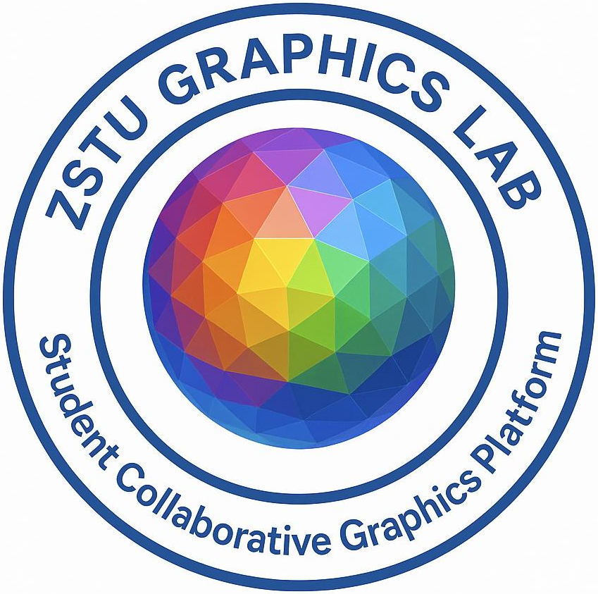

<h2 align="center">Researcher in Deep Learning & 3D Reconstruction</h2>

<p align="center">
  <em>Focused on Deep Learning, Gaussian Splatting, and 3D Reconstruction</em>
</p>


<p align="center" style="margin-bottom: 0px;">
  <a href="https://github.com/ZSTU-Graphics" target="_blank" rel="noopener noreferrer">
    
  </a>
</p>


### ⭐ Github Statsuages

<div style="display: flex; justify-content: center; align-items: center; gap: 0; flex-wrap: nowrap; width: 100%; font-size: 0;">
  <a href="https://github.com/ZSTU-Graphics" target="_blank" rel="noopener noreferrer" style="display:inline-block;">
    
  </a><a href="https://github.com/ZSTU-Graphics" target="_blank" rel="noopener noreferrer" style="display:inline-block;">
    
  </a>
</div>


<a href="https://github.com/ZSTU-Graphics" target="_blank" rel="noopener noreferrer">
  
</a>


### 💻 Personal Experimental Workstation

```scss
              \       |       /                 root@4090-2x48g 
               \      |      /                  ===============
   -------------\-----+-----/-------------      OS: Ubuntu 24.04.3 LTS x86_64 
                 \    |    /                    CPU: AMD EPYC 7B13 (64) @ 2.250GH
                  \   |   /                     GPU 1: NVIDIA GeForce RTX 4090 48G
                   \  |  /                      GPU 2: NVIDIA GeForce RTX 4090 48G
                    \ | /                       Memory: 10551MiB / 128596MiB 
                     \|/
                     /|\                        xiaoneng@xiaoneng-B660I-AORUS-PRO-DD 
                    / | \                       ====================================
                   /  |  \                      OS: Ubuntu 24.04.3 LTS x86_64
                  /   |   \                     CPU: Intel i7-14700KF (20) @ 5.500GH
   -------------/---- + ----\-------------      GPU: NVIDIA GeForce RTX 4080 SUPER
               /      |      \                  Memory: 18551MiB / 31926MiB
```


### 🧠 Deep Learning with ⚡ PyTorch

- MLP, CNN, UNet, Transformer, ViT
- Notable models: CLIP, SAM, DINO, Stable Diffusion, and other SOTA architectures

### 🕸️ 3D Reconstruction with 🌐 Gaussian Splatting
- 3D Segmentation
- Sparse View Reconstruction

###  📡 Contact & Links

- 💬 WeChat：`xiaoneng1024`  
- 🎵 [NetEase Cloud Music](https://y.music.163.com/m/user?id=2061101920)  
- 🎬 [DouBan](https://www.douban.com/people/234493346)

